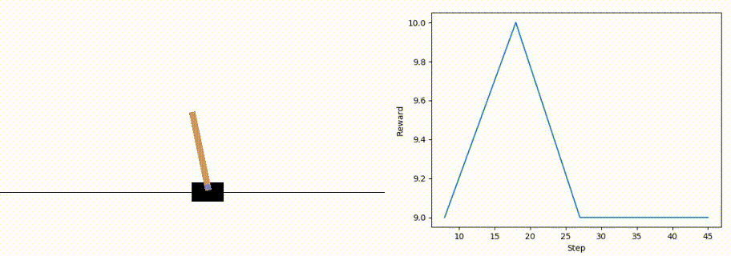

# Huskarl [](https://badge.fury.io/py/huskarl)

Huskarl is a framework for deep reinforcement learning focused on modularity and fast prototyping.
It's built on TensorFlow 2.0 and uses the `tf.keras` API when possible for conciseness and readability.

Huskarl makes it easy to parallelize computation of environment dynamics across multiple CPU cores.
This is useful for speeding up on-policy learning algorithms that benefit from multiple concurrent sources of experience such as A2C or PPO.
It is especially useful for computationally intensive environments such as physics-based ones.

Huskarl works seamlessly with [OpenAI Gym](https://gym.openai.com/) environments.

There are plans to support multi-agent environments and [Unity3D environments](https://unity3d.ai).

## Algorithms

Several algorithms are implemented and more are planned.

* [x] Deep Q-Learning Network (DQN)
* [x] Multi-step DQN
* [x] Double DQN
* [x] Dueling Architecture DQN
* [x] Advantage Actor-Critic (A2C)
* [x] Deep Deterministic Policy Gradient (DDPG)
* [x] Prioritized Experience Replay
* [ ] Proximal Policy Optimization (PPO)
* [ ] Curiosity-Driven Exploration


## Installation
You can install the latest version from source with:
```
git clone https://github.com/danaugrs/huskarl.git
cd huskarl
pip install -e .
```
If you prefer, you can get the packaged version from [PyPI](https://pypi.org/project/huskarl/):
```
pip install huskarl
```

## Examples
There are three examples included - one for each implemented agent type. To run the examples you will need [`matplotlib`](https://github.com/matplotlib/matplotlib) and [`gym`](https://github.com/openai/gym) installed. 

### [dqn-cartpole.py](https://github.com/danaugrs/huskarl/blob/master/examples/dqn-cartpole.py)

### [ddpg-pendulum.py](https://github.com/danaugrs/huskarl/blob/master/examples/ddpg-pendulum.py)

### [a2c-cartpole.py](https://github.com/danaugrs/huskarl/blob/master/examples/a2c-cartpole.py)


## Citing

If you use Huskarl in your research, you can cite it as follows:
```
@misc{salvadori2019huskarl,
    author = {Daniel Salvadori},
    title = {huskarl},
    year = {2019},
    publisher = {GitHub},
    journal = {GitHub repository},
    howpublished = {\url{https://github.com/danaugrs/huskarl}},
}
```

## About

_hùskarl_ in Old Norse means a warrior who works in his/her lord's service.
